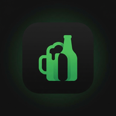

<div align="center">
  

  # AlkoRater

  **Offline-first PWA do odkrywania, katalogowania i oceniania piwa, wina oraz wódki.**

  [Otwórz aplikację](https://t91a60.github.io/AlkoRater/) · [Zgłoś problem](https://github.com/t91a60/AlkoRater/issues) · [Apache-2.0](LICENSE)
</div>

AlkoRater to mobilna aplikacja webowa działająca bez własnego serwera i konta użytkownika. Katalog produktów oraz oceny są dostępne lokalnie, dzięki czemu aplikacja pozostaje użyteczna także bez połączenia z internetem.

## Najważniejsze funkcje

- Przeszukiwalny lokalny katalog piw, win i wódek.
- Oceny w skali 1–5, własne notatki i lista zapisanych trunków.
- Filtry kategorii, ostatnio ocenione pozycje i panel z podsumowaniem kolekcji.
- Dane użytkownika zapisywane w `IndexedDB`, z awaryjnym wsparciem `localStorage`.
- Instalowalna aplikacja PWA z manifestem i service workerem do pracy offline.
- Interfejs mobile-first z obsługą gestów, haptyki tam, gdzie jest dostępna, oraz preferencji ograniczonego ruchu.

## Prywatność

Aplikacja nie wymaga logowania ani własnego backendu. Oceny i notatki pozostają w pamięci przeglądarki na urządzeniu. Wyczyszczenie danych witryny w przeglądarce usuwa także lokalne dane AlkoRater.

## Technologie

| Obszar | Wykorzystane rozwiązania |
| --- | --- |
| Aplikacja | HTML, CSS, moduły JavaScript ES |
| Dane i trwałość | Lokalne pliki JSON, IndexedDB, `localStorage` jako fallback |
| Offline | Web App Manifest i Service Worker |
| Jakość kodu | ESLint, Stylelint, Prettier, Vitest |
| Wdrożenie | GitHub Pages |

## Uruchomienie lokalne

Wymagany jest aktualny Node.js (workflow CI używa Node.js 20).

```bash
git clone https://github.com/t91a60/AlkoRater.git
cd AlkoRater
npm ci
npm run dev
```

Polecenie uruchamia statyczny serwer pod `http://localhost:3000`. Do testowania trybu offline używaj serwera HTTP — service worker nie działa przy otwieraniu plików przez `file://`.

## Kontrola jakości

```bash
npm run lint
npm run test
npm run format:check
```

Projekt jest statyczny; `npm run build` potwierdza ten fakt, a wdrożenie kopiuje gotowe pliki do GitHub Pages.

## Struktura projektu

```text
data/                 lokalne katalogi produktów
icons/                ikony aplikacji i ekrany startowe
src/css/              style interfejsu
src/js/app/           stan i stałe aplikacji
src/js/data/          repozytoria danych i ocen
src/js/services/      ładowanie danych, wyszukiwanie i zapis
src/js/ui/            renderowanie oraz interakcje
service-worker.js     cache zasobów do pracy offline
manifest.json         metadane PWA
```

## Wdrożenie

Każdy push do gałęzi `main` uruchamia sprawdzenie stylu i testy, a następnie publikuje aplikację na GitHub Pages: [t91a60.github.io/AlkoRater](https://t91a60.github.io/AlkoRater/).

## Licencja

Projekt jest udostępniony na licencji [Apache License 2.0](LICENSE).
